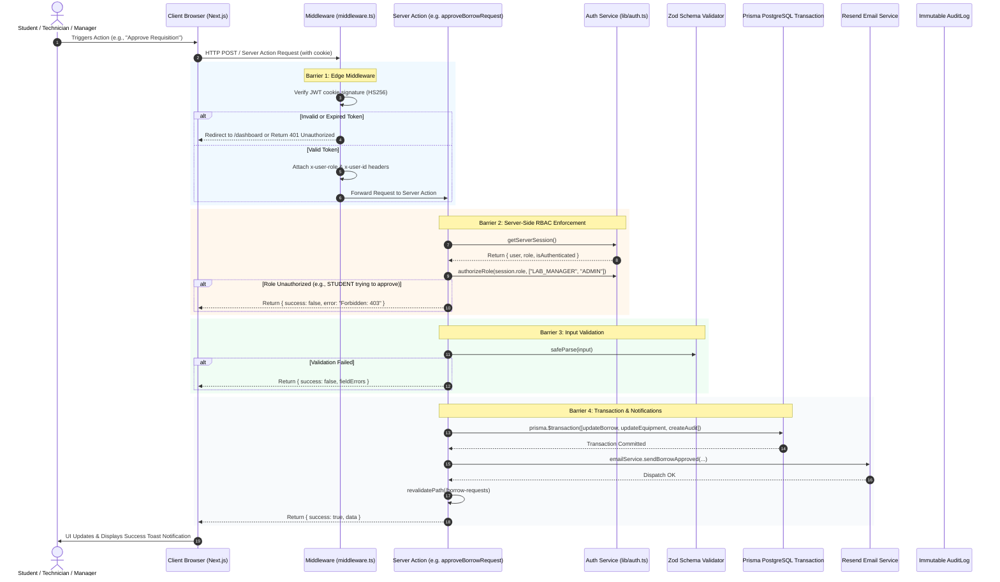

# LabVault — Authentication & Role-Based Authorization Flow

This document details the multi-layered security and server-side authorization architecture of **LabVault** (Assignment 2).

---

## 🔒 Layered Defense Model

LabVault enforces security across **three distinct defensive barriers**:

```
1. Client-Side UI Layer (Visual context & role simulation)
       ↓
2. Next.js Edge Middleware Layer (Route-level protection & cookie verification)
       ↓
3. Server Actions & Route Handlers (Mandatory cryptographic session validation & business authorization)
       ↓
4. Prisma Transactional Database & Immutable Audit Log
```

> [!CAUTION]
> **Zero Trust on Client State:**
> Client-side role selection (Zustand) is strictly for UI presentation and previewing. All Server Actions and API Route Handlers cryptographically decode the `labvault_session` signed JWT cookie on the server. Client-supplied role parameters are discarded and never trusted for permissions.

---

## 🔄 End-to-End Authorization Sequence Diagram



---

## 👥 Role Capability Matrix

| Feature / Action | STUDENT | TECHNICIAN | LAB_MANAGER | ADMIN |
| :--- | :---: | :---: | :---: | :---: |
| **Browse Equipment Catalog** | ✅ | ✅ | ✅ | ✅ |
| **View Equipment Details & Specs** | ✅ | ✅ | ✅ | ✅ |
| **Submit Borrow Requisition** | ✅ | ✅ | ✅ | ✅ |
| **Report Equipment Fault / Issue** | ✅ | ✅ | ✅ | ✅ |
| **Approve / Reject Borrow Requisitions** | ❌ | ❌ | ✅ | ✅ |
| **Physical Handover / Check-Out** | ❌ | ✅ | ✅ | ✅ |
| **Post-Return Inspection & Check-In** | ❌ | ✅ | ✅ | ✅ |
| **Update Maintenance Work Orders** | ❌ | ✅ | ✅ | ✅ |
| **Record ISO-17025 Calibrations** | ❌ | ✅ | ✅ | ✅ |
| **Commission New Equipment Asset** | ❌ | ❌ | ✅ | ✅ |
| **View System-Wide Audit Log Stream** | ❌ | ✅ | ✅ | ✅ |
| **System Settings & User Administration**| ❌ | ❌ | ❌ | ✅ |

---

## 🚫 Handling Authorization Failures

When authorization fails:
1. **Edge Middleware**: Blocks unauthorized navigation to restricted URL segments (e.g. `/calibration` for Students) and issues an instant 307 redirect to `/dashboard?error=unauthorized_calibration_access`.
2. **Server Actions**: Returns structured `{ success: false, error: "Forbidden: You do not have permission to perform this action." }` without performing mutations.
3. **Route Handlers (`/api/*`)**: Returns an HTTP `403 Forbidden` response with a JSON error payload.
4. **Audit Logging**: Unauthorized tampering attempts are logged to server telemetry.
