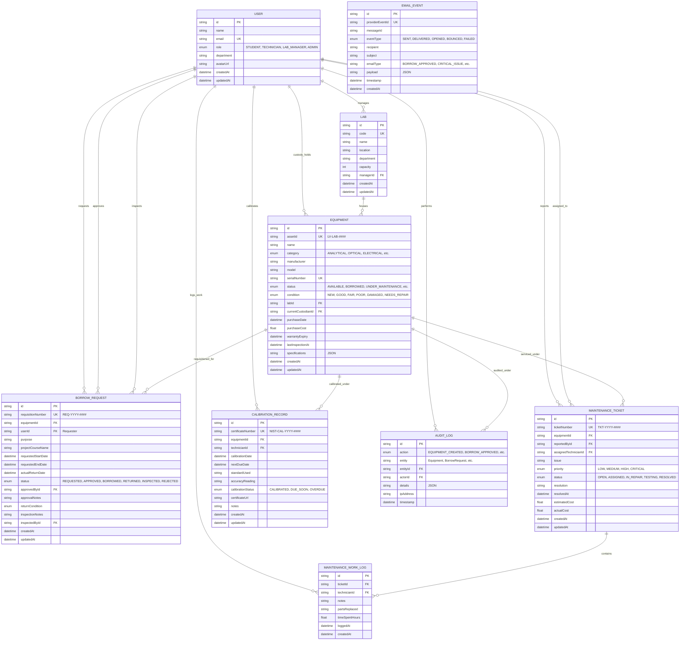

# LabVault — Database Relationships & Relational ER Model

This document outlines the normalized relational database architecture of **LabVault** (Assignment 2), built with **Prisma ORM** and **PostgreSQL**.

---

## 📊 Entity Relationship (ER) Diagram

---

## 🔗 Relational Rules & Foreign-Key Integrity

### 1. User & Laboratory Relationships
- A `Lab` has a single `managerId` referencing a `User` with `LAB_MANAGER` or `ADMIN` role.
- If a user is deleted, `managerId` is set to `SetNull` to preserve lab records.

### 2. Equipment Custody & Facility Allocation
- Every `Equipment` item MUST belong to a valid `Lab` (`onDelete: Restrict`).
- An equipment item may optionally have a `currentCustodianId` referencing an active borrowing student or technician (`onDelete: SetNull`).
- When a borrow request progresses to `BORROWED`, `currentCustodianId` is updated atomically to the borrower's ID.

### 3. Borrowing & Chain of Custody
- A `BorrowRequest` links a `User` (requester) and an `Equipment` item.
- It tracks two additional user relationships: `approvedById` (the Lab Manager who approved the loan) and `inspectedById` (the Technician who completed the post-return check-in).
- If the equipment is deleted, historical borrow requisitions cascade delete (`onDelete: Cascade`).

### 4. Maintenance Work Orders & Work Logs
- A `MaintenanceTicket` is linked to the faulty `Equipment` and the reporting `User`.
- `assignedTechnicianId` references the active duty technician.
- Each ticket can contain multiple `MaintenanceWorkLog` entries (`1:N`), recording technician timestamps, diagnostic notes, and replaced components.

### 5. Metrology & ISO-17025 Calibrations
- `CalibrationRecord` references `Equipment` and the certified `technicianId` who performed the calibration procedure with NIST-traceable standards.

### 6. Audit Trail & Chain of Custody
- Every status transition across equipment, loans, work orders, and calibrations writes an immutable record to `AuditLog`.
- `AuditLog.actorId` links directly to the authenticated `User` who performed the mutation.
