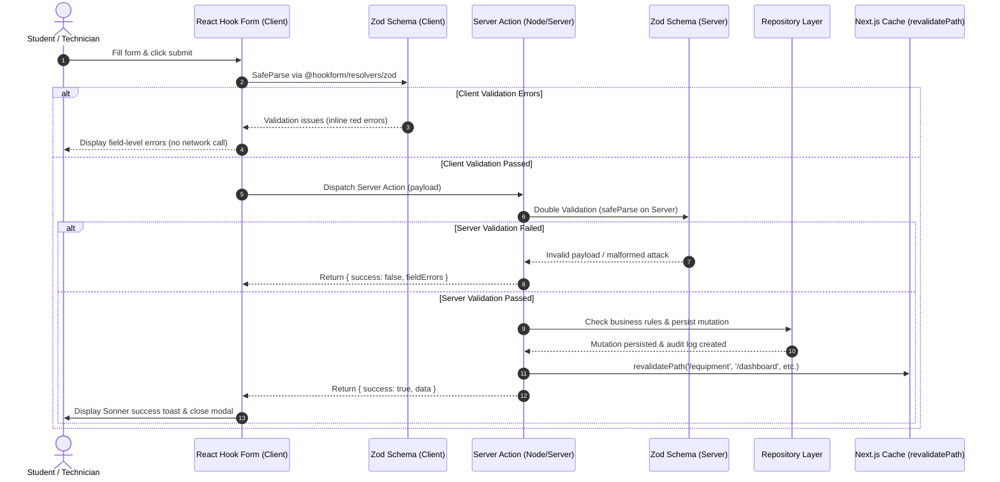

# Type-Safe Server Actions & Double-Validation Architecture

## 1. Flow Diagram

---

## 2. Double Validation Rationale

Client-side validation improves user experience by providing **immediate instant feedback** without network latency. However, **client validation can always be bypassed** (e.g., via direct API tools or forged requests).

Therefore, LabVault enforces **defense-in-depth**:
1. **Client Phase:** React Hook Form validates the inputs using `@hookform/resolvers/zod`.
2. **Server Action Phase:** Inside `"use server"` functions, the incoming `rawInput` is validated again with `borrowEquipmentSchema.safeParse(rawInput)`.

---

## 3. Server Actions Implemented

| Server Action | Source File | Purpose | Business Rule Validations |
| :--- | :--- | :--- | :--- |
| `createBorrowRequestAction` | `src/actions/borrow.ts` | Submits custody requisition | Verifies equipment exists, ensures asset is not `RETIRED` or `LOST`, verifies start date $\le$ end date |
| `approveBorrowRequestAction` | `src/actions/borrow.ts` | Approves requisition | Verifies manager role, changes status to `APPROVED`, reserves asset |
| `checkoutBorrowRequestAction`| `src/actions/borrow.ts` | Physical custody handover | Transfers custodian identity, sets equipment status to `BORROWED` |
| `inspectAndReturnAction` | `src/actions/borrow.ts` | Checks in returned equipment | Records condition rating; if `DAMAGED` or `CRITICAL`, automatically opens Maintenance Ticket |
| `reportEquipmentIssueAction` | `src/actions/maintenance.ts`| Reports malfunction | Flags equipment as `UNDER_MAINTENANCE`, creates prioritized work order |
| `updateMaintenanceStatusAction`| `src/actions/maintenance.ts`| Updates repair logs | Adds technician work log, updates parts replaced, restores to `AVAILABLE` upon `RESOLVED` |
| `scheduleCalibrationAction` | `src/actions/calibration.ts`| Logs metrology certificate | Validates NIST standard, updates equipment next due date |
| `addEquipmentAction` | `src/actions/equipment.ts` | Commissions new asset | Validates unique serial number, assigns lab room, sets status to `AVAILABLE` |

---

## 4. Optimistic UI Implementation

In `src/components/forms/borrow-form-modal.tsx`, when a student submits a borrow request:
1. An **optimistic request object** with `status: "REQUESTED"` and `isOptimistic: true` is immediately dispatched to local state.
2. The user sees the requisition pending instantly with zero delay.
3. If the server action succeeds, the server-confirmed record replaces the optimistic record.
4. If the server action returns an error (e.g. asset retired), the optimistic record is rolled back and an error toast is displayed.
